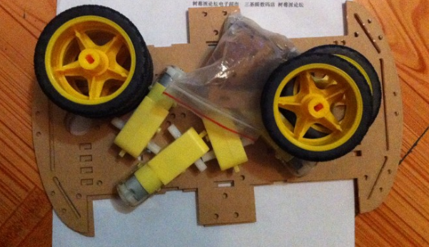
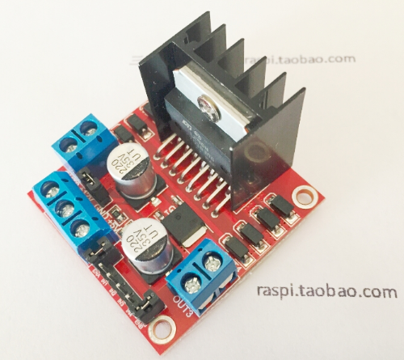
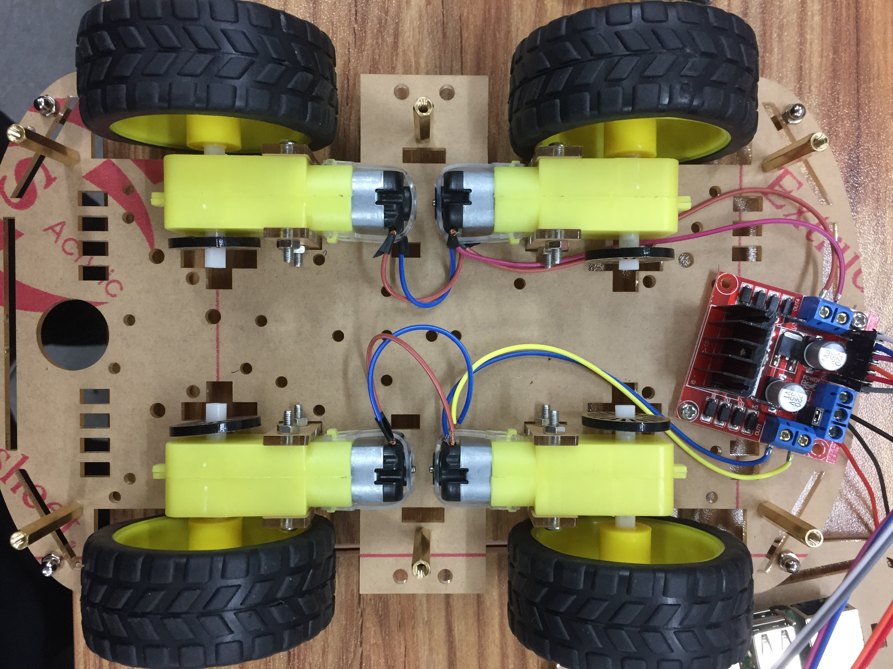
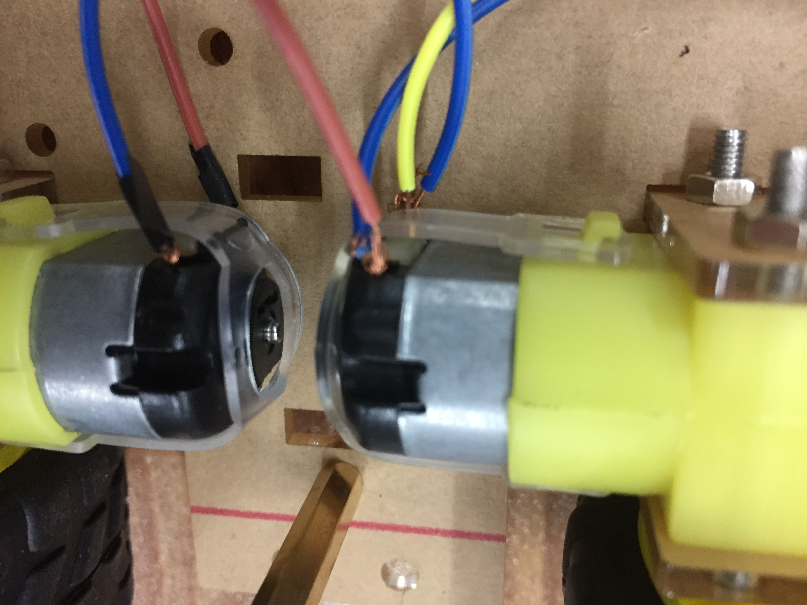
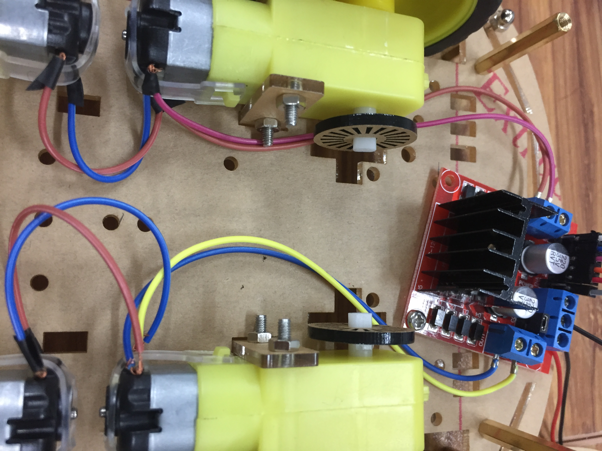
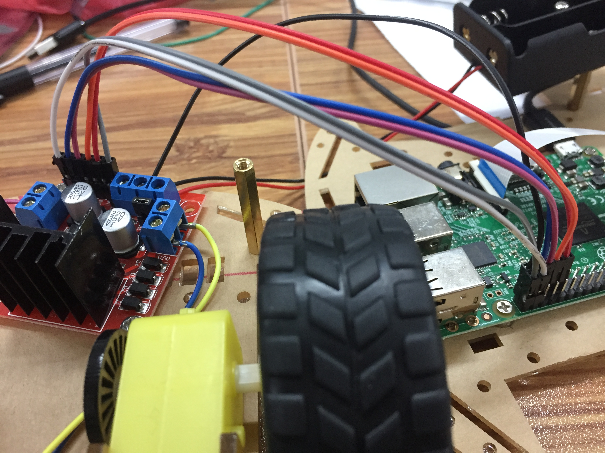
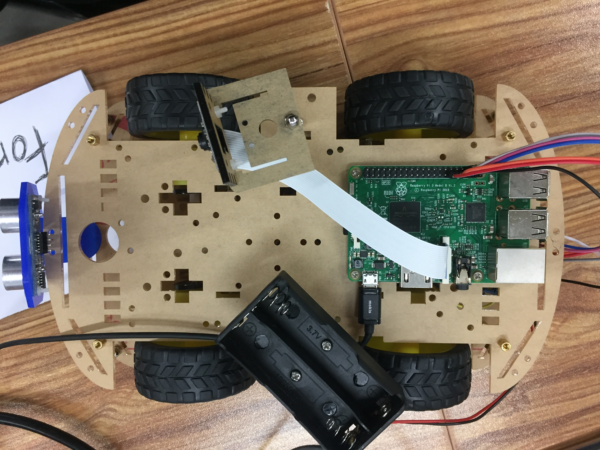

# Pi Motor

## 需要的配件

- 树莓派
- 树莓派电源及数据线（或移动电源）
- 树莓派小车底盘（包含小车底盘及四个减速电机）


- L298N 电机驱动板    


- 18650 电池组
- 杜邦线 螺丝 螺母 铜柱等
- 可选：摄像头，超声波传感器等各种传感器

## 安装

### 底盘

依次安装电机和轮胎，在底盘上找合适位置固定 L298N 电机驱动板。

### 电机连接

电机可以用剪断的杜邦线，将同一侧的电机连接在一起。    
为了保证同侧电机方向相同，电机间连线要交叉连接。

### 电机连接驱动板


同侧电机连接好之后，将两侧电机分别连接到 L298N 电机驱动板的 OUT1, OUT2 和 out3, ou4 接口。

### 驱动板连接树莓派

L298N 电机驱动板ENA, ENB, IN1, IN2, IN3, IN4引脚分别接到树莓派GPIO引脚。    

如图所示的引脚接线为：
| L298N | Raspberry Pi |
| :---: | :----------: |
| ENA   | GPIO21       |
| ENB   | GPIO20       |
| IN1   | GPIO06       |
| IN2   | GPIO13       |
| IN3   | GPIO19       |
| IN4   | GPIO26       |
    
+12V 插口接到 18650 电池组正极，GND 接到 18650 电池组负极和树莓派 GND 引脚。

### 安装完成后的外观

连接好电机和驱动板之后，将小车上底盘固定，将树莓派和 18650 电池组固定到上底盘的合适位置。并可以自己添加需要的其他传感器。

## 运行
### 启动 pi-motor 容器
```bash
# docker
sudo docker run --privileged -d -p 15000:15000 maoqide/pi-motor
```
然后通过浏览器访问 pi 的15000端口，通过 web 界面控制小车。
